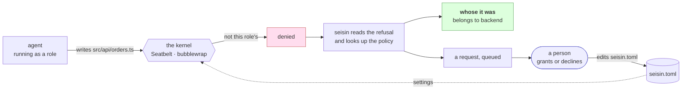

# seisin

[](https://github.com/carlostapiaolguin3-stack/seisin/actions/workflows/test.yml)
[](https://www.npmjs.com/package/seisin)
[](LICENSE)
[](package.json)
[](package.json)

**[The short version, with the demos playing →](https://carlostapiaolguin3-stack.github.io/seisin/)** · this page is the long one.

> **seisin** *(n.)* — the legal possession of a piece of land. Not who owns it on paper: who holds it now.

**Give each AI agent its own folders and its own keys.** The kernel enforces it, and when it blocks something it tells you *whose* file it was.

A **permission layer**, not a sandbox — it sits on top of one. The isolation comes from the OS; what seisin adds is the part an OS cannot know: which role a path belongs to, and therefore who to ask next.

*Two outside reviews went looking for ways past the boundary. [What they found, what broke, and what is still open →](docs/what-it-has-been-put-through.md)*

*And what running four cells of agents behind it actually cost — including the numbers that did not survive a re-check. [Field notes →](docs/field-notes.md)*

**Three ways in, and they say the same thing.** The **CLI** is what a person types and what
every agent runs under. The **console** (`seisin ui`) is for a person deciding something. The
**MCP server** is for an agent asking about its own situation. A change to what any of them
says lands in all three — [CONTRIBUTING](CONTRIBUTING.md#three-surfaces-and-a-change-lands-in-all-of-them)
says why, and a test holds one half of it.

<details>
<summary><b>Contents</b></summary>

**Start here** · [Sixty seconds](#sixty-seconds) · [Why this exists](#why-this-exists) · [What it is for, and what it is not for](#what-it-is-for-and-what-it-is-not-for) · [Install](#install) · [Use](#use) · [Configure](#configure)

**Living with it** · [Day one](#what-will-look-like-a-bug-on-the-first-day) · [Which agents it has been run with](#which-agents-it-has-been-run-with) · [Where the first policy comes from](#where-the-first-policy-comes-from) · [When it says no, it leaves a request behind](#when-it-says-no-it-leaves-a-request-behind) · [When the boundary is right and the agent cannot hear it](#when-the-boundary-is-right-and-the-agent-cannot-hear-it) · [Scratch space, and what it costs](#scratch-space-and-what-it-costs)

**Secrets** · [How it protects secrets](#how-it-protects-secrets) · [Keys in full](docs/keys.md)

**Looking at it** · [What the log says about the policy](#what-the-log-says-about-the-policy) · [Seeing what happened](#seeing-what-happened) · [Ask your own assistant](#ask-your-own-assistant)

**The honest parts** · [How it holds](#how-it-holds) · [What it is not](#what-it-is-not) · [Why not a container](#why-not-a-container) · [Prior art](#prior-art) · [Status](#status)

**Deeper** · [Keys](docs/keys.md) · [Agents](docs/agents.md) · [Day one](docs/first-day.md) · [Scratch](docs/scratch.md) · [Glossary](docs/glossary.md) · [What it has been put through](docs/what-it-has-been-put-through.md) · [Field notes](docs/field-notes.md) · [Decisions](docs/decisions.md) · [Permission requests](docs/permission-requests.md) · [Contributing](CONTRIBUTING.md)

</details>



**The kernel says no. seisin says whose.** That second half is the whole thing: other
permission layers in this space answer *yes* or *no*, or at best *which rule* said no — and a
refusal that also names an owner turns a dead end into a handoff.


```
$ seisin run frontend -- sh -c 'echo // fix >> src/api/orders.ts'
  sh: src/api/orders.ts: Operation not permitted
  seisin: 1 kernel denial(s) recorded

  1 pending request(s)

    #1  frontend wants write on src/api/** (owned by backend)
        first asked over src/api/orders.ts

    seisin grant <n> [--reason "…"]   ·   seisin decline <n> [--reason "…"]
```

**Whose it was, at the moment it was denied.** Other permission layers answer *yes* or *no*, and the good ones say which rule it was and how to widen it. Answering **"no, and it belongs to `backend`"** turns a block into a handoff — and one a person can approve in a command, rather than a line somebody has to remember to go and read.

The kernel is what denies; the name comes from the policy. That first line is all the boundary itself can say — no path, no reason, nothing to read afterwards — so seisin reads the refusal out of the kernel's own log and answers the question it leaves open. On Linux only the hook can do that; [the ask is upstream](docs/upstream/cli-violations.md) as [issue #582](https://github.com/anthropics/sandbox-runtime/issues/582).

The agent can ask directly too, from inside the box:

```
$ seisin run frontend -- seisin whose src/api/orders.ts
  src/api/orders.ts belongs to backend
  you are frontend. Hand it over rather than working around it.
```

## Sixty seconds

```bash
npm install -g seisin
cd your-repo
seisin init                            # proposes a policy from what the repo already says
seisin check                           # read it before you trust it
seisin wire                            # let the agent record what it does
seisin run frontend -- claude -p "…"   # run an agent inside its own territory
```

On Linux, [three system packages first](#install). Everything below is why it works and where it does not.

---

## Why this exists

Two things are true about agent permissions today, and both are in the official docs.

**1. Permission rules match text, not behaviour.** From the Claude Code documentation:

> Calls matching `rm *` **as written** are denied […] Other `Bash` calls, **including `/bin/rm`**, fall through to the permission mode.

A rule is a string comparison against a command someone might not spell that way. A child process does not spell it at all.

**2. The tools that *do* ask the OS don't know who anyone is.** They take one global policy. That is fine for one agent. The moment you run two — separate worktrees, a frontend agent and a backend agent, a hotfix agent and a sprint agent — "may this be written?" is the wrong question. The right one is **"whose is it?"**

`seisin` answers the second question and hands the first one to the operating system.

```
   ONE GLOBAL POLICY                     WHOSE IS IT?

   frontend ──┐                          frontend ──► src/web/**    ok
              ├──► may this be written?  backend  ──► src/api/**    ok
   backend  ──┘           yes
                                         frontend ──► src/api/**    no
   two agents, one answer,                    belongs to backend
   the whole repo, all the time               → hand it over, do not work around it
```

## What it is for, and what it is not for

> **It turns an agent's mistake into a contained mistake. It does not turn a hostile
> agent into a harmless one.**
>
> Two outside reviews have gone through it looking for ways past the boundary and
> found eleven things between them. [What it has been put
> through](docs/what-it-has-been-put-through.md) lists all of them — what was
> fixed, what was measured, and what is still open.

That distinction is the whole threat model, and it is worth reading before you install
rather than after.

**It holds against an agent that is wrong.** One that edits the file it was not asked
about, reads the key meant for another role, or calls an API nobody declared. The kernel
denies, and it does not care how the command was spelled — verified against a grandchild
process, an absolute path, a symlink, a `python -c`, and a shell redirect the agent fell
back to when its own file API was denied.

**It is not built to hold against an agent that is trying.** Measured, in this repo's own
fixtures:

| | |
|---|---|
| it can read everything except the declared keys | by design — an agent that cannot read the repo cannot work. `seisin scan` exists because secrets live elsewhere too |
| it can write anything inside its own territory | including staging an exfiltration, or destroying its own uncommitted work with `rm` |
| `base64` defeats the redaction | only the literal value is masked, and only on stdout and stderr |
| an allowed domain is an allowed channel | if the agent's own API is reachable, so is everything that goes through it |
| the hook is text-based and evadable | on purpose — what escapes it goes **unblocked by nothing**: the kernel still refuses. On macOS it is no longer unexplained either, because [the kernel's own refusals are recorded](#seeing-what-happened); on Linux it is. Either way, attribution is not a control |

And three things that outweigh all of the above:

1. **It is days old and has one author.** Around three thousand lines that nobody has
   audited except its writer and one field report. "Secure" is not a word earned that fast.
2. **The enforcement is someone else's beta.** `sandbox-runtime` describes itself as a
   research preview with an evolving API. A hole there is a hole here.
3. **Two platforms tested, by one person, on one machine each.**

For several of your own agents, on your own machine, getting in each other's way — that is
what this is for, and it is a great deal better than nothing. For putting an agent you do
not control in front of data you care about, it is not.

## Install

```bash
npm install -g seisin
```

That pulls in [`@anthropic-ai/sandbox-runtime`](https://github.com/anthropics/sandbox-runtime), which does the enforcing: Seatbelt on macOS, bubblewrap on Linux. No containers, no VMs, no daemon. seisin has **no other dependencies**.

**On Linux you also need three system packages** — the runtime refuses to start without
them rather than running unconfined, which is the right failure and an unhelpful message:

```bash
apt install bubblewrap ripgrep socat      # or your distro's equivalent
```

**On Ubuntu 24.04 and newer**, unprivileged user namespaces are off by default and
bubblewrap needs one. Every run dies with `bwrap: No permissions to create new
namespace`:

```bash
sudo sysctl -w kernel.apparmor_restrict_unprivileged_userns=0
```

Worth knowing what this looks like when you hit it: seisin appears to deny
*everything*, because the sandbox never starts. It is not a policy problem and
no amount of editing `seisin.toml` will move it.

**Inside a container** bubblewrap needs to create namespaces and mount `/proc`, which a
default Docker container forbids. `--cap-add SYS_ADMIN --security-opt seccomp=unconfined`
gets namespaces; mounting `/proc` needs `--privileged`. If you cannot grant that, run
seisin on the host and let the container be what it sandboxes.

## Use

```bash
seisin init                              # proposes a seisin.toml for this repo
seisin check                             # print the map, run nothing
seisin run frontend -- claude -p "…"     # run an agent as that role
seisin explain frontend write src/api/x  # ask one question, exit 0 or 1
seisin review                            # what the log says about the policy
seisin wire                              # install the PreToolUse hook in this repo
seisin ui                                # a console for editing the map
```

## Configure

One file at the root of your repo. Anything not listed is denied — there is no permissive default.

```toml
[keys]
dir = ".secrets"          # every key lives here; roles name the files they may read

[network]
allow = ["github.com", "*.github.com"]

[roles.frontend]
writes = ["src/web/**", "public/**"]
keys   = ["netlify-token.txt"]

[roles.backend]
writes   = ["src/api/**", "migrations/**"]
keys     = ["database-url.txt", "sentry-dsn.txt"]
network  = ["api.stripe.com"]   # this role only — it replaces [network] rather than adding
```

`[network] allow` is the fallback for roles that do not name their own. A role that needs one
extra host should say so on its own line: a domain in the global list is reachable by every
role, including the ones whose whole job is to have nothing to reach.

> ⚠️ **HTTP(S) works; SSH does not.** The allow list is enforced by proxies the runtime
> starts, and although one of them is a SOCKS5 proxy that could carry SSH, the chain breaks
> at its last link: it requires authentication and the `ProxyCommand` the runtime wires up
> cannot send any. Measured — `curl https://github.com` returns `200`, `ssh -T git@github.com`
> cannot resolve the hostname, and `git ls-remote git@github.com:…` reaches the proxy and
> dies at the handshake.
>
> **Use an HTTPS remote for git**, and run SSH deploys outside the confined turn.
> [Why, exactly, and whose gap it is →](docs/decisions.md#ssh-does-not-work-and-it-is-not-seisin-that-decided-that)

A role can also give something back. `never_writes` subtracts from its own `writes`, and it
wins however wide the grant is:

```toml
[roles.backend]
writes       = ["services/api/**"]
never_writes = ["services/api/.git/index.lock"]   # works in a worktree; the canonical index is not its business
```

It is per role on purpose — there is no global version, because a global deny on a lock file
breaks every role that legitimately commits there. A refusal it causes says so by name and
leaves **no request** in the queue: approving one would undo a subtraction somebody wrote. An
entry that no `writes` of the same role covers, or a misspelling like `never_write`, is named
by `seisin check` instead of being ignored.

A role that starts a server — a dev server, the backend an end-to-end test drives — needs
`local_binding = true`. Listening is off by default and per role: most roles never start one.
It is wider than the name: the role can also listen on every interface and **connect to every
port on localhost**, so anything listening there without authentication is within its reach.
`seisin check` says this next to the role. That is macOS: on Linux each role already has a
private loopback, serves without the key, and reaches nothing on the host either way.

`seisin init` will propose this from whatever your repo already says: `.claude/agents/`, then `CODEOWNERS`, then a blank start. It **proposes** — a generated policy you did not read is not a policy.

## What will look like a bug on the first day

Four shapes a correct policy still produces that read as breakage: a granted file whose
neighbours are not granted, a lock file in somebody else's repository, a tool that reports a
denied write as a *readonly database*, and an agent that diagnoses file permissions when the
answer is ownership.

All four came out of one production window where none of them was the boundary misbehaving.

**[What each one looks like, and what to do →](docs/first-day.md)**

## Which agents it has been run with

Claude Code, opencode, codex, gemini and a LangGraph script, each against a real policy with
the boundary actually applied — not a smoke test.

**One thing is worth knowing before you start: an agent that sandboxes itself has to be told
to stop.** `codex` confines every command it runs, and no OS applies a second profile to a
process that already has one. seisin says so before it starts one, because the error you get
otherwise names neither seisin, nor the agent, nor the fix.

**[Every agent, its version, what it needed, and how each reacted to being stopped →](docs/agents.md)**

## What the log says about the policy

`check` reads the config and tells you what it would do. `review` reads what
actually happened and tells you where the config was wrong about it.

```
$ seisin review

  60 decisions, 2026-08-23 to 2026-09-11

  Stopped, repeatedly
       9×  frontend write src/api/checkout — belongs to backend
       4×  backend write src/web — belongs to frontend

  Granted, never used
    frontend  public/**
    backend   migrations/**

  Owned by nobody
       5×  legacy
```

Three questions, and the middle one is the reason this exists. **Every
permission file only ever grows**, in every system, and always for the same
reason: nobody can prove a line is dead, so the safe move is to leave it. Here
the log can prove it — `public/**` was granted and nothing was written there in
three weeks. That is the only direction that makes a policy *smaller*.

The first is the one that changes how a denial reads. Forty blocks on one
directory is not an agent misbehaving; it is a policy that is wrong, and until
you add them up it looks like forty tidy amber lines.

It is arithmetic over the log. No model, no network, no heuristics — the
argument this whole tool makes is that interpreting text is the wrong way to
decide things, and a component that reads the log and forms an opinion would
contradict it on the way in. Every finding carries the window it was computed
over, because *never used* means nothing without *in how long*.

## Where the first policy comes from

Every permission tool dodges this question. Written by hand, the first policy is a guess, and
the first unjustified denial is when the tool gets uninstalled. So don't write it — watch, then
write:

```bash
seisin run frontend --observe -- claude -p "…"   # records, denies nothing
seisin init --from-observations                  # writes seisin.toml.observed
```

It lands as `.observed`, not as your config. A policy generated behind your back is not a
policy: diff it, then move it.

## When it says no, it leaves a request behind

A permission tool that can only say no is a tool people uninstall — the loop of *denied,
stop, edit a config, run again* is three context switches for one line of policy, and the
cheapest way to stop it is to widen the policy and never look again. That is how a permission
file becomes seven hundred entries nobody reads.

So a denial leaves something to act on, and many denials in one directory are **one** request:

```
  1 pending request(s)

    #1  frontend wants write on src/api/** (owned by backend) · asked 3×
        first asked over src/api/orders.ts

    seisin grant 1 --reason "…"   ·   seisin decline 1 --reason "…"
```

The grant writes its own provenance next to the line it adds:

```toml
writes = ["src/api/**"]   # granted 2026-09-12 · asked 3× · "frontend owns checkout now"
```

**Approving is never a tool call.** An agent can read the queue and draft the change; only a
person applies it, in a terminal or in the console. That asymmetry is deliberate and it is
the reason the MCP server exists at all.

**[How a denial becomes a request, why it deduplicates, and what a grant records →](docs/permission-requests.md)**

## Ask your own assistant

```jsonc
{ "mcpServers": { "seisin": { "command": "seisin", "args": ["mcp"] } } }
```

> *who owns src/api, and what is frontend waiting on?*

Seven tools. Four answer about the policy — `state`, `explain`, `requests`, `draft_grant` —
and three about what has happened: `activity` is the raw log, and **`causes` and `walls` are
the two an agent actually wants.** `activity` hands over events and leaves the assistant to
re-derive the shape without the policy; `causes` returns the day grouped by path and by name
with how many are on paths nobody owns, and `walls` returns what a role keeps being denied
*and would still be denied today*. Both are recomputed against the policy, so something
granted since stops counting — which is the part a log cannot know.

Read-only **by construction** — the server opens nothing for writing, and a test
asserts that no tool in it mutates anything. It can draft the exact change a
request would make; applying it is a command a person runs. Zero dependencies:
the official SDK wanted 91 packages for a server that speaks JSON on two file
descriptors.

## Seeing what happened

```bash
seisin log --verdict denied      # what the agents tried and could not do
seisin watch                     # follow it live
seisin ui                        # the same thing, for a person deciding
```

```
04:13:26  allowed  frontend write src/web/app.ts
04:13:26  denied   frontend write src/api/server.ts  → backend
04:13:27  denied   frontend read .secrets/database.txt  → backend
```

One append-only JSONL under `.seisin/`, and that is the whole storage design — no daemon, no
database, and `watch` is a tail.

**The agent cannot reach that file.** `.seisin/` is in no role's territory, because a record
the recorded process can edit is not a record. The hook sends each line to `seisin run` over
a unix socket granted by path and the parent does the writing, so the only verb available
from inside the box is *append one line*. A hostile agent can still add noise to its own
history; what it cannot do is change what is already there.

**Two writers, and they see different things.** The **hook** reports the attempt before it
happens — which is how an *allowed* action gets recorded at all — and it is text-based and
evadable, on purpose. The **kernel** reports what it actually denied, and is not fooled by
anything. What escapes the hook goes unexplained, never unblocked.


It opens on what needs a decision, not on the policy. Five numbers ride on every screen and
each is a link to the page that explains it — including two a log cannot answer, because
they are recomputed against the policy: how much of the day is **one cause**, and how many
of those causes are on paths **nobody owns**.

## How it holds

| layer | what it does | can it be talked around? |
|---|---|---|
| your agent's `allow`/`deny` rules | match the command string before it runs | yes — `/bin/rm`, a heredoc, a child process |
| **seisin** | decides what to ask for, and names the owner | it doesn't enforce, it explains |
| **sandbox-runtime → Seatbelt / bubblewrap** | the OS denies the syscall | no |

```
   Write tool · Bash `rm -rf` · /bin/rm · python -c "open(…)" · a grandchild
                                │
                                │  however it was spelled, it arrives as one syscall
                                ▼
                             KERNEL
                                │
                                │  against the policy `seisin run` installed
                                ▼
                     inside this role's territory?
                          │                  │
                         yes                 no
                          │                  │
                          ▼                  ▼
                        done         Operation not permitted
                                             │
                                             │  and, on a separate path, the hook
                                             ▼
                                    "belongs to backend"
                                    explanation — never the boundary
```

That split is deliberate, and it is why seisin is small. Because the kernel is the boundary, seisin never has to be airtight — it only has to be *legible*. A leaky explainer costs you a confusing log line. A leaky enforcer costs you the repo.

Verified by the test suite, which runs real commands in a real sandbox:

```
✔ a role reads the key it declares
✔ a role cannot read another role's key
✔ each role reads its own, so the deny is not just blanket
✔ a role writes inside its territory
✔ a role cannot write outside it
✔ reading another role's code still works
✔ the boundary survives a grandchild process
✔ an absolute path does not walk around the rule
```

## How it protects secrets

Four ways a secret leaves a process, and seisin closes three. The fourth is named rather
than hidden.

| way out | closed by |
|---|---|
| reading another role's key file | the kernel — the key directory is denied, each declared key re-allowed |
| a key riding in the environment | the launcher — the child's environment is **built, not inherited** |
| spilling a key the role does hold | the launcher — masked on stdout and stderr, even split across buffers |
| sending it somewhere | the kernel — egress is allow-only, by hostname. HTTP(S) works; [SSH does not](docs/decisions.md#ssh-does-not-work-and-it-is-not-seisin-that-decided-that) |
| **a key stored outside the declared directories** | **nothing.** `seisin scan` finds them so you know |

```toml
[keys]
dir = [".secrets"]

[roles.frontend]
key_mode = "env"
keys = ["netlify-token.txt",                       # a file the role may read
        "TOKEN=file://.secrets/all.env#NETLIFY",   # one value, and no read at all
        "OP=op://vault/item/field"]                # anything that prints a secret
```

A **provider** is a command with a `{ref}` placeholder, so adding 1Password, Bitwarden or
`sops` is TOML and not code. `file://` ships built in. The parent resolves, never the
confined process. Nothing degrades: a provider that fails stops the run.

**[Key directories, references, providers, delivery modes and nine recipes →](docs/keys.md)**

**Measured, over four agent cells and three days: every refused read was a read of something
the policy had declared a key.** 148 of them, no exceptions, from five roles — all running
searches that swept a repository root. That is how a key gets read without anyone deciding
it should.

## When the boundary is right and the agent cannot hear it

seisin answers *whose is this* at the moment of the denial — once, mid-turn — and then the
sentence is gone. Nothing carries it forward, so the agent tries again.

Measured on a real team: of **345 denials, 88 (25%) were a repeat of something that same role
had already been denied.** One role spent 37 calls on two walls, hitting one of them nineteen
times. Every denial was correct. Not one was a false positive. It still cost thirty-seven
calls, because *correct* and *heard* are different properties and only the first was being
measured.

So a denial now carries its own history:

```
deploy/x.yml belongs to infra. It is not dev's to change — hand it over rather than
working around it. You have been denied this 3 times now; it is not going to work on
the fourth try. Already queued for a person to answer…
```

And the standing list is a command:

```
$ seisin walls dev
WALLS — you have already been refused these, and the policy still refuses them.
Do not retry; the reason is where the other way in is.
  19× write ../equipo/.git/index.lock
      ../equipo/.git/index.lock belongs to plataforma-dev
  6× read ~/.npmrc
      no role declares ~/.npmrc — add it under a [roles.<name>] keys list
  (23 of your calls went into retrying these.)
```

**A wall is recomputed against the policy, not read out of the log.** If the role would be
allowed today, it is not a wall — whatever happened yesterday. The obvious implementation is a
time window, on the argument that an old wall may have been granted since; the window is a
proxy for the question, and seisin has the policy right there, so it asks the question. A grant
makes its wall disappear on the next turn instead of when a window expires. Same move as
`owners` and the request queue: recompute rather than believe.

Silent on the first denial, by design. A counter that reads `1×` every time is noise on the
turn where the sentence is already doing its job.

**Whether it makes an agent stop is not demonstrated, and will not be for a while.** The
obvious way to check is to compare repeats before and after — but the repeats were 86% one
lock file, and the release before this one deleted that wall outright with
`GIT_OPTIONAL_LOCKS=0`. Repeats did fall, by a lot, and **the fall is the wall going away,
not the sentence landing**: both shipped within days of each other and the bigger cause is the
other one. Isolating this needs a forward test — walls per role, rounds with the hook wired
and no git locks in the way — not the history. Measured in the field and written up rather
than smoothed over, because the alternative is a claim the numbers do not carry.

## Scratch space, and what it costs

Territory alone is correct and unusable: an agent writes session state under its own config
directory and its tools write to the temp dir, so *your folders and nothing else* stops the
agent from starting. Every role gets `~/.claude`, `~/.cache`, `$TMPDIR` and `/tmp` — and that
is a real hole, because two roles share a temp directory and territory does not hold in it.
It is one line to turn off.

**[What that costs, and how to close it →](docs/scratch.md)**

## What it is not

- **Not a sandbox.** [`sandbox-runtime`](https://github.com/anthropics/sandbox-runtime) is the sandbox, and it is Anthropic's. seisin writes its settings and explains its refusals.
- **Not an orchestrator.** It does not run your agents, schedule them, or merge their work. It runs one command as one role.
- **Not a secret manager.** It scopes *reads* of files you already have. Where those files come from is your problem.
- **Not what a single agent needs first.** If only one agent ever touches the repo,
  *whose file is this* has one answer, and the ownership half of this tool is dead
  weight. Turn on your agent's own sandboxing instead — Claude Code has it built in,
  over this same runtime, with nothing to install.

  What is left over for one agent is real but narrow: the environment gets built
  rather than inherited (measured on one machine: **15 variables kept, 60 dropped**,
  among them `GITHUB_TOKEN` and the AWS pair), reads of the declared key directory
  are denied to everything, and the network allowlist covers the whole process
  rather than one tool. Worth it if that is a gap you actually have. seisin starts
  earning its setup at **two** agents, and that is where it was designed to be.

## Why not a container

A fair question, and the honest answer is that a container is *more* isolation
than this. If what you need is to run something you do not trust at all, run it
in a VM — [Kaiden](https://openkaiden.ai), [Containarium](https://containarium.dev)
and a growing shelf of others do that well, and this does not try to.

They answer **"can this process reach the host?"** seisin answers a different
question:

```
container / microVM        one box, one boundary, everything inside it is equal
seisin                     one repo, several roles, and a boundary between them
```

Put two agents in one container and they are back where they started: the same
files, the same keys, no answer to *whose is it*. That question is not about
isolation strength at all — it is about ownership, and it is the one thing an
operating system cannot know for you.

Which is also why this is thin. Enforcement is
[`@anthropic-ai/sandbox-runtime`](https://github.com/anthropics/sandbox-runtime)
asking the kernel; seisin is the layer that decides what to ask for and says
whose file it was when the answer is no. The two compose — put seisin inside a
container if you want both, and the roles still hold.

| | what it answers |
|---|---|
| VM / microVM | can this reach the host |
| container | can this reach the host, cheaply |
| **seisin** | **whose file is this, and may this role change it** |

## Prior art

This space already has good work, and seisin is not the first thing here:

- [`anthropics/sandbox-runtime`](https://github.com/anthropics/sandbox-runtime) — the enforcement. seisin is a thin thing on top of a serious one.
- [`kornysietsma/claude-code-permissions-hook`](https://github.com/kornysietsma/claude-code-permissions-hook) — granular `PreToolUse` rules, one global policy.
- [`XuebinMa/agent-guard`](https://github.com/XuebinMa/agent-guard) — a permission-enforcement SDK, also one global policy.
- [`NVIDIA/OpenShell`](https://github.com/NVIDIA/openshell) — a runtime that sandboxes an agent with Landlock and seccomp, under a declarative policy. Serious, and the closest thing here by weight.
- [`dredozubov/hazmat`](https://github.com/dredozubov/hazmat) — runs the agent as a different system user, with `pf` rules and snapshots.
- [`nolabs-ai/nono`](https://github.com/nolabs-ai/nono) — a kernel sandbox for agents on the host (Seatbelt, Landlock), with per-tool child sandboxes, a credential proxy with endpoint filtering, approval webhooks and a tamper-evident audit log. The most complete sandbox here, and on a Mac the one that enforces through the same kernel seisin does. `nono why` explains *which rule* denied something and how to allow it; it has no notion of *whose* it was.
- *Directory ownership* is recommended in half the multi-agent write-ups. As far as I could find, nobody enforces it, and nobody names the owner in the refusal. That gap is the reason for this repo.

### One sentence to tell these apart, because the names all sound the same

**OpenShell, hazmat and nono isolate the agent from your machine. seisin separates roles from
each other inside one repository, and when it blocks something it names the owner.**

Those are different problems and the first one is not the one this solves. If what you want
is "this agent cannot touch anything outside its box", they do that and OpenShell does it
with a large organisation behind it. If what you want is "four agents work in the same
repository and none of them edits another's files — and when one is stopped it is told whose
those files are", nothing above answers that, which is why this exists.

They compose rather than compete: the agent seisin confines could be running inside one of
them.

*One detail worth knowing before you compare, and it is about placement rather than quality.
Read from [OpenShell's support matrix][osm] on 2026-09-21, not measured here: macOS is a
supported platform, and on it "these kernel modules run inside the Docker Desktop Linux VM,
not on the host kernel". So on a Mac, OpenShell confines an agent inside a Linux VM, and
seisin confines a process on the host through Seatbelt. Both are kernel enforcement; they are
not the same kernel, and which one you want depends on whether the thing you are protecting is
on the host. seisin [says where each of its own claims was
measured](docs/what-it-has-been-put-through.md#where-each-claim-was-actually-run).*

[osm]: https://docs.nvidia.com/openshell/reference/support-matrix

## Status

`0.2.0`, 326 tests, of which **26 need `@anthropic-ai/sandbox-runtime` installed**
and run real commands through the real kernel — and CI fails if the sandbox half *skips*, because
a green run that quietly tested nothing looks exactly like a real one. That is not hypothetical:
those eighteen skipped on Linux for a day, behind a runtime check that looked for the global
install and missed the bundled one, and hid a defect that broke `seisin run` on that platform
entirely. **326/326 on macOS 15 and on `ubuntu-latest` under bubblewrap**, nothing skipped on
either, Node 18/20/22 in CI at every push — and 225/225 the same way on Debian 12.15
with bubblewrap 0.8.0, the last time the suite was run in Docker.
[Which claim was measured where](docs/what-it-has-been-put-through.md#where-each-claim-was-actually-run),
and [what running agents behind it cost the people using it](docs/field-notes.md).
The config format may still move before `1.0` — if it does, `seisin check` will
tell you what changed.

**What is genuinely open**, so nobody spends an afternoon on something that is
already done:

| | |
|---|---|
| **Windows** | the runtime has a backend. seisin has never been pointed at it, and no CI runner covers it |
| **Deleting inside your own territory** | not covered, and not coverable here — the ask is upstream as [issue #545](https://github.com/anthropics/sandbox-runtime/issues/545), open and unanswered since 2026-09-13, [with the measurement behind it](docs/upstream/denyUnlink.md) and [a demo](docs/demo/) |
| **`init` heuristics** | it reads `.claude/agents/` then `CODEOWNERS`. Every other convention is a guess nobody has made yet |
| **SSH inside a turn** | the transport exists — the runtime's SOCKS proxy filters by `(port, host)` — and the `ProxyCommand` it wires up cannot authenticate to it, so `git` over SSH dies at the handshake. [The ask](docs/upstream/ssh-proxycommand.md) is written and verified, not filed. Use an HTTPS remote |

Every word above has one meaning, listed in [the glossary](docs/glossary.md) — the boundary
**denies**, a person **declines**, seisin **refuses** a config it cannot enforce. A tool whose
product is a sentence cannot afford two words for one thing.

Issues and pull requests welcome — [CONTRIBUTING.md](CONTRIBUTING.md) says what is actually
different about contributing here, which is mostly that a claim has to be downstream of
something measured. If you are reporting something that got past the boundary, do it
[privately](SECURITY.md); `seisin log --verdict denied` and the `seisin.toml` are the two
things that make it reproducible.

## The name

A deed says who owns land. **Seisin** is the older idea underneath: who is actually standing on it.

That is the question this tool answers. Not *may this be written* — the kernel settles that — but
*whose is it*, which is the one that tells an agent what to do next.

## License

MIT
