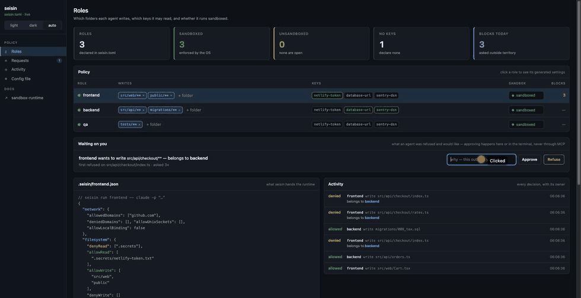

# seisin

[](https://github.com/carlostapiaolguin3-stack/seisin/actions/workflows/test.yml)
[](https://www.npmjs.com/package/seisin)
[](LICENSE)
[](package.json)
[](package.json)

> **seisin** *(n.)* — the legal possession of a piece of land. Not who owns it on paper: who holds it now.

**Give each AI agent its own folders and its own keys.** The kernel enforces it, and when it blocks something it tells you *whose* file it was.

A **permission layer**, not a sandbox — it sits on top of one. The isolation comes from the OS; what seisin adds is the part an OS cannot know: which role a path belongs to, and therefore who to ask next.

*Two outside reviews went looking for ways past the boundary. [What they found, what broke, and what is still open →](docs/what-it-has-been-put-through.md)*

*And what running four cells of agents behind it actually cost — including the numbers that did not survive a re-check. [Field notes →](docs/field-notes.md)*

<details>
<summary><b>Contents</b></summary>

**Start here** · [Sixty seconds](#sixty-seconds) · [Why this exists](#why-this-exists) · [What it is for, and what it is not for](#what-it-is-for-and-what-it-is-not-for) · [Install](#install) · [Use](#use) · [Configure](#configure)

**Living with it** · [What will look like a bug on the first day](#what-will-look-like-a-bug-on-the-first-day) · [Which agents it has been run with](#which-agents-it-has-been-run-with) · [Where the first policy comes from](#where-the-first-policy-comes-from) · [When it says no, it leaves a request behind](#when-it-says-no-it-leaves-a-request-behind) · [When the boundary is right and the agent cannot hear it](#when-the-boundary-is-right-and-the-agent-cannot-hear-it) · [Scratch space, and what it costs](#scratch-space-and-what-it-costs)

**Secrets** · [How it protects secrets](#how-it-protects-secrets) · [A database is four files](#a-database-is-four-files-and-you-declare-it-once) · [A key can be a reference instead of a file](#a-key-can-be-a-reference-instead-of-a-file) · [The provider contract](#the-provider-contract) · [Recipes](#recipes)

**Looking at it** · [What the log says about the policy](#what-the-log-says-about-the-policy) · [Seeing what happened](#seeing-what-happened) · [Ask your own assistant](#ask-your-own-assistant)

**The honest parts** · [How it holds](#how-it-holds) · [What it is not](#what-it-is-not) · [Why not a container](#why-not-a-container) · [Prior art](#prior-art) · [Status](#status)

**Deeper** · [Glossary](docs/glossary.md) · [What it has been put through](docs/what-it-has-been-put-through.md) · [Field notes](docs/field-notes.md) · [Decisions](docs/decisions.md) · [Permission requests](docs/permission-requests.md) · [Contributing](CONTRIBUTING.md)

</details>


```
$ seisin run frontend -- sh -c 'echo // fix >> src/api/orders.ts'
  sh: src/api/orders.ts: Operation not permitted
  seisin: 1 kernel denial(s) recorded

  1 pending request(s)

    #1  frontend wants write on src/api/** (owned by backend)
        first asked over src/api/orders.ts

    seisin grant <n> [--reason "…"]   ·   seisin decline <n> [--reason "…"]
```

**Whose it was, at the moment it was denied.** Every other permission layer in this space answers *yes* or *no*. Answering **"no, and it belongs to `backend`"** turns a block into a handoff — and one a person can approve in a command, rather than a line somebody has to remember to go and read.

The kernel is what denies; the name comes from the policy. That first line is all the boundary itself can say — no path, no reason, nothing to read afterwards — so seisin reads the refusal out of the kernel's own log and answers the question it leaves open. On Linux only the hook can do that; [the ask is upstream](docs/upstream/cli-violations.md) as [issue #582](https://github.com/anthropics/sandbox-runtime/issues/582).

The agent can ask directly too, from inside the box:

```
$ seisin run frontend -- seisin whose src/api/orders.ts
  src/api/orders.ts belongs to backend
  you are frontend. Hand it over rather than working around it.
```

## Sixty seconds

```bash
npm install -g seisin
cd your-repo
seisin init                            # proposes a policy from what the repo already says
seisin check                           # read it before you trust it
seisin wire                            # let the agent record what it does
seisin run frontend -- claude -p "…"   # run an agent inside its own territory
```

On Linux, [three system packages first](#install). Everything below is why it works and where it does not.

---

## Why this exists

Two things are true about agent permissions today, and both are in the official docs.

**1. Permission rules match text, not behaviour.** From the Claude Code documentation:

> Calls matching `rm *` **as written** are denied […] Other `Bash` calls, **including `/bin/rm`**, fall through to the permission mode.

A rule is a string comparison against a command someone might not spell that way. A child process does not spell it at all.

**2. The tools that *do* ask the OS don't know who anyone is.** They take one global policy. That is fine for one agent. The moment you run two — separate worktrees, a frontend agent and a backend agent, a hotfix agent and a sprint agent — "may this be written?" is the wrong question. The right one is **"whose is it?"**

`seisin` answers the second question and hands the first one to the operating system.

```
   ONE GLOBAL POLICY                     WHOSE IS IT?

   frontend ──┐                          frontend ──► src/web/**    ok
              ├──► may this be written?  backend  ──► src/api/**    ok
   backend  ──┘           yes
                                         frontend ──► src/api/**    no
   two agents, one answer,                    belongs to backend
   the whole repo, all the time               → hand it over, do not work around it
```

## What it is for, and what it is not for

> **It turns an agent's mistake into a contained mistake. It does not turn a hostile
> agent into a harmless one.**
>
> Two outside reviews have gone through it looking for ways past the boundary and
> found eleven things between them. [What it has been put
> through](docs/what-it-has-been-put-through.md) lists all of them — what was
> fixed, what was measured, and what is still open.

That distinction is the whole threat model, and it is worth reading before you install
rather than after.

**It holds against an agent that is wrong.** One that edits the file it was not asked
about, reads the key meant for another role, or calls an API nobody declared. The kernel
denies, and it does not care how the command was spelled — verified against a grandchild
process, an absolute path, a symlink, a `python -c`, and a shell redirect the agent fell
back to when its own file API was denied.

**It is not built to hold against an agent that is trying.** Measured, in this repo's own
fixtures:

| | |
|---|---|
| it can read everything except the declared keys | by design — an agent that cannot read the repo cannot work. `seisin scan` exists because secrets live elsewhere too |
| it can write anything inside its own territory | including staging an exfiltration, or destroying its own uncommitted work with `rm` |
| `base64` defeats the redaction | only the literal value is masked, and only on stdout and stderr |
| an allowed domain is an allowed channel | if the agent's own API is reachable, so is everything that goes through it |
| the hook is text-based and evadable | on purpose — what escapes it goes **unblocked by nothing**: the kernel still refuses. On macOS it is no longer unexplained either, because [the kernel's own refusals are recorded](#seeing-what-happened); on Linux it is. Either way, attribution is not a control |

And three things that outweigh all of the above:

1. **It is days old and has one author.** Around three thousand lines that nobody has
   audited except its writer and one field report. "Secure" is not a word earned that fast.
2. **The enforcement is someone else's beta.** `sandbox-runtime` describes itself as a
   research preview with an evolving API. A hole there is a hole here.
3. **Two platforms tested, by one person, on one machine each.**

For several of your own agents, on your own machine, getting in each other's way — that is
what this is for, and it is a great deal better than nothing. For putting an agent you do
not control in front of data you care about, it is not.

## Install

```bash
npm install -g seisin
```

That pulls in [`@anthropic-ai/sandbox-runtime`](https://github.com/anthropics/sandbox-runtime), which does the enforcing: Seatbelt on macOS, bubblewrap on Linux. No containers, no VMs, no daemon. seisin has **no other dependencies**.

**On Linux you also need three system packages** — the runtime refuses to start without
them rather than running unconfined, which is the right failure and an unhelpful message:

```bash
apt install bubblewrap ripgrep socat      # or your distro's equivalent
```

**On Ubuntu 24.04 and newer**, unprivileged user namespaces are off by default and
bubblewrap needs one. Every run dies with `bwrap: No permissions to create new
namespace`:

```bash
sudo sysctl -w kernel.apparmor_restrict_unprivileged_userns=0
```

Worth knowing what this looks like when you hit it: seisin appears to deny
*everything*, because the sandbox never starts. It is not a policy problem and
no amount of editing `seisin.toml` will move it.

**Inside a container** bubblewrap needs to create namespaces and mount `/proc`, which a
default Docker container forbids. `--cap-add SYS_ADMIN --security-opt seccomp=unconfined`
gets namespaces; mounting `/proc` needs `--privileged`. If you cannot grant that, run
seisin on the host and let the container be what it sandboxes.

## Use

```bash
seisin init                              # proposes a seisin.toml for this repo
seisin check                             # print the map, run nothing
seisin run frontend -- claude -p "…"     # run an agent as that role
seisin explain frontend write src/api/x  # ask one question, exit 0 or 1
seisin review                            # what the log says about the policy
seisin wire                              # install the PreToolUse hook in this repo
seisin ui                                # a console for editing the map
```

## Configure

One file at the root of your repo. Anything not listed is denied — there is no permissive default.

```toml
[keys]
dir = ".secrets"          # every key lives here; roles name the files they may read

[network]
allow = ["github.com", "*.github.com"]

[roles.frontend]
writes = ["src/web/**", "public/**"]
keys   = ["netlify-token.txt"]

[roles.backend]
writes   = ["src/api/**", "migrations/**"]
keys     = ["database-url.txt", "sentry-dsn.txt"]
network  = ["api.stripe.com"]   # this role only — it replaces [network] rather than adding
```

`[network] allow` is the fallback for roles that do not name their own. A role that needs one
extra host should say so on its own line: a domain in the global list is reachable by every
role, including the ones whose whole job is to have nothing to reach.

`seisin init` will propose this from whatever your repo already says: `.claude/agents/`, then `CODEOWNERS`, then a blank start. It **proposes** — a generated policy you did not read is not a policy.

## What will look like a bug on the first day

Four shapes that a correct policy still produces, and that a reader reads as breakage. All
four come out of one production window — four agent cells, ~370 confined turns over three
days, 1,409 kernel denials — where none of them was the boundary misbehaving. They are here
because every one of them cost someone an afternoon before it cost this paragraph.

**1 · Granting a file does not grant its neighbours.** The kernel grants exactly the path you
wrote. Anything a tool creates *beside* it — a database journal, a lock file, the temporary
file of an atomic write — is a sibling, and a sibling is outside the grant. The failure then
arrives in the tool's own words rather than as a permission error, which is why it survives a
policy review: the policy looks right because it *is* right about the file you named.

`seisin check` says so before you hit it:

```
N role(s) grant individual files rather than folders: reviewer (3 of 11)
```

Grant the folder where the tool needs neighbours. `seisin check <role>` names the paths.

**The Claude Code case is worth stating outright**, because it is the agent most people will
point this at first: `Write` and `Edit` do not write the file you named. They write
`<name>.tmp.<pid>.<random>` next to it and rename over the target. So a grant on a literal
file path is both correct and useless — `seisin explain` answers *allowed* about the
destination, the kernel answers `Operation not permitted` about the temporary, and neither is
lying. Grant the directory.

**2 · `.git/index.lock`, in a repo the role does not own.** In that window this single
filename was **1,071 of the 1,409 denials** — three quarters of everything the kernel said no
to. A role runs `git status`, git tries to refresh the index of a checkout that belongs to
another role, and the lock write is denied.

It is noise, not a wall, and the distinction is measurable: inside the box
`git status --short --branch` and `git log` still exit 0. Git cannot refresh its index cache
and carries on without it. If a role genuinely needs to commit, give it **its own worktree**
rather than a share of the main index — two agents staging into one index corrupt each other
regardless of who is allowed to write it.

**3 · Worktrees are two paths for one repo.** A policy names the canonical checkout; the
process is running in a linked worktree somewhere else entirely, and to the kernel that is a
different place. seisin resolves the pair rather than making you write both — `seisin whose`
and `seisin explain` answer the same thing from either side, and say which checkout they are
talking about. Worth knowing it is handled, because the symptom when a tool does *not* handle
it is a role denied inside its own territory.

**4 · SQLite reports a denied write as `attempt to write a readonly database`** — see
[below](#which-agents-it-has-been-run-with); it is the one that sends you to debug the
database instead of the policy, and the reason `seisin wire` exists.

Where these stand: the sibling case is a `check` warning instead of a surprise, the worktree
case is resolved in the tool, the SQLite case is named by the hook, and the git one is
friction that gets logged rather than silenced — a boundary that hides what it denied is the
thing this project exists to argue against.

## Which agents it has been run with

seisin wraps a process, so in principle it works with any agent that runs as one — CLI or not. In
practice "in principle" is not a claim worth making about a permission tool, so here is what has
actually been exercised:

| agent | version | result |
|---|---|---|
| **Claude Code** (`claude -p`) | 2.1.x | Territory and keys enforced; network egress denied an undeclared domain by name |
| **opencode** (`opencode run`) | **1.18.30** | Same, **on a free model with no API key at all** |
| **LangGraph** (`python graph.py`) | **1.2.11** | Same, **enforced against the interpreter's own `open()`** — in-process tools, no child command to match |
| **codex** (`codex exec`) | **0.150.1** | Same, with its own sandbox off — see below. Refused twice: its patch tool, then the shell redirect it fell back to |

**seisin now says this before it starts one.** The error you get otherwise —
`sandbox-exec: sandbox_apply: Operation not permitted` — names neither seisin, nor the agent,
nor the fix, which in a tool whose claim is that a refusal explains itself is the worst message
available. It is a short closed list, checked before the spawn, and it only warns about an
agent whose own sandbox is actually on.

The codex run is the one that needed a flag. **An agent that sandboxes itself has to stop.** `codex` confines each command it runs with its
own `sandbox-exec` profile, and macOS refuses to apply a second Seatbelt profile to a process
that already has one — `sandbox_apply: Operation not permitted`, with the most permissive
profile that can be written, on both layers. So an agent like that runs under seisin with its
own sandbox turned off — `codex exec --dangerously-bypass-approvals-and-sandbox`, whose own
help says it is "intended solely for running in environments that are externally sandboxed".
It starts fine either way (`codex 0.150.1`, `gemini 0.57.0`, both verified), which is why this
is worth saying out loud: the failure arrives later, on the first command the agent tries to
confine.

Asked to write into another role's territory, codex failed through its patch tool, went looking
for a file ACL with `ls -le@` and `stat`, found nothing, and fell back to a shell redirect that
failed too:

```
/bin/zsh -lc "printf 'pisado\n' > qa/informe.md"
  exited 1: zsh:1: operation not permitted
```

Same shape as opencode, including the wrong diagnosis — it reasoned about file permissions,
not about ownership. That is the case for the hook: the boundary holds either way, but only the
hook can say *whose* it was.

All four on macOS 15 (Seatbelt). Linux is no longer a one-off measurement on one machine:
[CI](.github/workflows/test.yml) runs the whole suite on Ubuntu and macOS, Node 18/20/22,
on every push — and fails if the sandbox half *skips*.

The opencode run is the interesting one, because **opencode has no per-path sandbox flag** —
its only permission control is `--auto`, "auto-approve permissions that are not explicitly
denied". Asked to write into another role's territory it failed twice: once through its own
`FileSystem.writeFile`, and again through the shell redirect it fell back to.

```
Error: Unknown: FileSystem.writeFile (.../qa/informe.md)
$ echo "revisado" > .../qa/informe.md
zsh:1: operation not permitted
```

That is the point of putting the boundary in the kernel instead of in the agent: **an agent
that cannot confine itself is confined anyway**, and adding a new one costs no adapter.

It also found a real bug. The scratch list named `~/.claude` and `~/.codex` and stopped there,
so the first agent that was neither did not fail a task — it failed to start, on its own log
file. A boundary that only fits the agents its author happened to use is a coincidence, not a
boundary. The XDG directories are in the list now.

The LangGraph run answers a different question: **an agent framework is not a CLI.** Its tools
are Python calls inside the same process, so there is no child command for a rule to match and no
argv to inspect — the write is the interpreter's own `open()`. A six-node graph asked to write into
another role's territory was denied there, denied again through the shell redirect it fell back
to, denied the other role's key, and denied an undeclared domain. Run as the other role, the same
graph gave the mirror image — every territory and key answer flipped, the undeclared domain denied
for both — and its SQLite checkpointer persisted normally inside whichever territory was its own.

One caveat belongs beside that row rather than after it: **a role is scoped to a process, and a
graph is one process.** Every node of one graph shares one territory and one set of keys. Per-node
territory means per-node subprocess, which is the thing an in-process framework exists to avoid.
seisin fits a multi-agent framework at the boundary of the whole graph, not between its agents.

And one failure mode worth meeting here rather than at 2am: SQLite reports a denied write as
`attempt to write a readonly database`, not as a permission error. That reads like a misconfigured
database, and you will debug the database. The hook names the owner instead — it is the case
`seisin wire` is for.

**Re-verified without an agent in the loop**, which is better evidence: an agent in the middle
makes a permission test non-deterministic — in that first run the agent reported the opposite
of what it had actually done. Wrapping a plain shell and a plain interpreter instead:

| as `dev`, with `qa/**` owned by `qa` | result |
|---|---|
| `sh -c 'echo x > proyecto/FILE.txt'` (own territory) | rc=0, created |
| `sh -c 'echo x > qa/report.md'` (shell redirect) | `Operation not permitted`, rc=1 |
| `python3 -c "open('qa/report.md','w')"` (the program's own syscall) | `PermissionError: [Errno 1]` |
| `rm -f proyecto/FILE.txt` (**destructive, inside** own territory) | **rc=0, file gone** |

The last row is not a bug, it is the shape of the tool: seisin answers *where*, not *what*.
A team running this in front of an agent fleet measured how often it matters: across ~330
rounds, sixty-six times a role reached for a command that would have destroyed its own
uncommitted work, and the kernel boundary permitted every one. The ask that would close it
is written up in [docs/upstream/denyUnlink.md](docs/upstream/denyUnlink.md), filed against
the sandbox runtime rather than worked around here.

If you would rather see it than read it, [thirty seconds in a temp
directory](docs/demo/) — an agent confined to its own project deletes the git history of the
repo it is working in, and the `.git/` left behind looks intact. Nothing installed, seisin not
used, because the gap is the runtime's and every tool on top of it inherits the same one.

## What the log says about the policy

`check` reads the config and tells you what it would do. `review` reads what
actually happened and tells you where the config was wrong about it.

```
$ seisin review

  60 decisions, 2026-08-23 to 2026-09-11

  Stopped, repeatedly
       9×  frontend write src/api/checkout — belongs to backend
       4×  backend write src/web — belongs to frontend

  Granted, never used
    frontend  public/**
    backend   migrations/**

  Owned by nobody
       5×  legacy
```

Three questions, and the middle one is the reason this exists. **Every
permission file only ever grows**, in every system, and always for the same
reason: nobody can prove a line is dead, so the safe move is to leave it. Here
the log can prove it — `public/**` was granted and nothing was written there in
three weeks. That is the only direction that makes a policy *smaller*.

The first is the one that changes how a denial reads. Forty blocks on one
directory is not an agent misbehaving; it is a policy that is wrong, and until
you add them up it looks like forty tidy amber lines.

It is arithmetic over the log. No model, no network, no heuristics — the
argument this whole tool makes is that interpreting text is the wrong way to
decide things, and a component that reads the log and forms an opinion would
contradict it on the way in. Every finding carries the window it was computed
over, because *never used* means nothing without *in how long*.

## Where the first policy comes from

Every permission tool dodges this question. Written by hand, the first policy is a guess, and
the first unjustified denial is when the tool gets uninstalled. So don't write it — watch, then
write:

```bash
seisin run frontend --observe -- claude -p "…"   # records, denies nothing
seisin init --from-observations                  # writes seisin.toml.observed
```

It lands as `.observed`, not as your config. A policy generated behind your back is not a
policy: diff it, then move it.

## When it says no, it leaves a request behind

A permission tool that can only say no is a tool people uninstall. The loop —
denied, stop, go edit a config, run again — is three context switches for one
line of policy, and the cheapest way to make it stop is to widen the policy
generously and never look again. That is how a permission file becomes seven
hundred entries nobody can read.

So a denial leaves something you can act on:

```
  frontend  write  src/api/orders.ts
  denied — src/api/orders.ts belongs to backend

  1 pending request(s)

    #1  frontend wants write on src/api/** (owned by backend) · asked 3×
        first asked over src/api/orders.ts

    seisin grant 1 --reason "…"   ·   seisin decline 1 --reason "…"
```

Many denials in one directory are **one** request, not many — an agent denied
on `a.ts` and then on `b.ts` is not asking two questions. And the grant records
where it came from, next to the line it adds:

```toml
[roles.frontend]
writes = [
  "src/web/**",
  "src/api/**"   # granted 2026-09-12 · asked 3× · "frontend owns checkout now"
]
```

```
   frontend denied on src/api/orders.ts
              │
              ▼
        request #1 ◄──── denied again on b.ts ──── same request, asked 2×
              │
              │   nothing inside the box moves it from here
              ▼
      ┌───────┴────────┐
      ▼                ▼
  seisin grant 1   seisin decline 1
      │                ▼
      │           policy unchanged,
      ▼           the reason recorded
  one line added to seisin.toml,
  carrying where it came from
```

Without that, a policy is a list of permissions with no history, and the only
safe thing to do with a line nobody remembers is leave it there.

**Approving is deliberately not a tool call.** An agent — or an MCP server on
your behalf — can read the queue and draft the change. Turning it into policy
takes a person in a channel the agent does not have. The public API reflects
that: `pendingRequests` is exported, the functions that approve are not.
[The reasoning is written down](docs/permission-requests.md).



Two places, both human: `seisin grant <n>` in a terminal, or the console, where
the queue is a panel with a reason field and two buttons. Approving there edits
your `seisin.toml` in place and the territory on screen changes with it.

The console is allowed to hold that half and the MCP server is not, and the
reason is measured rather than asserted: a confined role curling the console's
own port gets the same nothing it gets from a domain outside its allowlist. The
MCP server, by contrast, speaks on the agent's own stdio.

The notice rides on what you are already looking at: `seisin run` prints the
queue when the run ends, in the same terminal that just showed you the denial.
There is no daemon and nothing to leave running.

## Ask your own assistant

```jsonc
{ "mcpServers": { "seisin": { "command": "seisin", "args": ["mcp"] } } }
```

> *who owns src/api, and what is frontend waiting on?*

Read-only **by construction** — the server opens nothing for writing, and a test
asserts that no tool in it mutates anything. It can draft the exact change a
request would make; applying it is a command a person runs. Zero dependencies:
the official SDK wanted 91 packages for a server that speaks JSON on two file
descriptors.

## Seeing what happened

```bash
seisin log --verdict denied      # what the agents tried and could not do
seisin watch                     # follow it live
```

```
04:13:26  allowed  frontend write src/web/app.ts
04:13:26  denied   frontend write src/api/server.ts  → backend
04:13:27  denied   frontend read .secrets/database.txt  → backend
```

One append-only JSONL under `.seisin/`, and that is the whole storage design — no daemon, no
database. `watch` is a tail. The file is the shared state, so anything that can read it can
watch it.

**The agent cannot reach that file.** `.seisin/` is not in any role's territory, because a
record the recorded process can edit is not a record. The hook sends each line to `seisin run`
over a unix socket granted by path, and the parent does the writing — so the only verb
available from inside the box is *append one line*: no seek, no truncate, no unlink. What a
hostile agent can still do is send lines, so it can add noise to its own history. What it can
no longer do is change what is already there.

**Two writers, and they see different things.**

The **hook** reports the attempt before it happens, which is how an allowed action
gets recorded at all. It has to be installed: `seisin wire` writes the
`PreToolUse` entry into this repo's `.claude/settings.json` — the project's,
never your machine's. It is also text-based and evadable, on purpose.

The **kernel** reports what it actually denied. On macOS every Seatbelt denial
lands in the system log with its operation, its absolute path and the runtime's
own attribution tag, and `seisin run` reads that stream for the duration of the
run. Nothing to install, nothing to evade — and it catches exactly what the hook
missed:

```
$ seisin run frontend -- sh -c 'echo // fix >> src/api/orders.ts'
  sh: src/api/orders.ts: Operation not permitted
  seisin: 1 kernel denial(s) recorded

  1 pending request(s)
    #1  frontend wants write on src/api/** (owned by backend)
        first asked over src/api/orders.ts
```

That is with no hook installed. Before this, the same run left `Operation not
permitted` on the terminal and an empty log — which is how four real defects in
production each cost a night to find: every one of them looked like a file that
had quietly stopped growing.

Skip `wire` and the boundary holds exactly as well, denials are still recorded
and still queue a request; what you lose is the record of what was *allowed*,
which is what `init --from-observations` is built out of. `seisin check` says so
until you run it.

**On Linux only the hook writes.** bubblewrap does not log denials and the
runtime's substitute is not readable from outside it, so `seisin run` says so
once and records nothing from the kernel. [The ask is
upstream](docs/upstream/cli-violations.md) as [issue #582][582], filed 2026-09-20
against 0.0.77, open and unanswered.

[582]: https://github.com/anthropics/sandbox-runtime/issues/582

## How it holds

| layer | what it does | can it be talked around? |
|---|---|---|
| your agent's `allow`/`deny` rules | match the command string before it runs | yes — `/bin/rm`, a heredoc, a child process |
| **seisin** | decides what to ask for, and names the owner | it doesn't enforce, it explains |
| **sandbox-runtime → Seatbelt / bubblewrap** | the OS denies the syscall | no |

```
   Write tool · Bash `rm -rf` · /bin/rm · python -c "open(…)" · a grandchild
                                │
                                │  however it was spelled, it arrives as one syscall
                                ▼
                             KERNEL
                                │
                                │  against the policy `seisin run` installed
                                ▼
                     inside this role's territory?
                          │                  │
                         yes                 no
                          │                  │
                          ▼                  ▼
                        done         Operation not permitted
                                             │
                                             │  and, on a separate path, the hook
                                             ▼
                                    "belongs to backend"
                                    explanation — never the boundary
```

That split is deliberate, and it is why seisin is small. Because the kernel is the boundary, seisin never has to be airtight — it only has to be *legible*. A leaky explainer costs you a confusing log line. A leaky enforcer costs you the repo.

Verified by the test suite, which runs real commands in a real sandbox:

```
✔ a role reads the key it declares
✔ a role cannot read another role's key
✔ each role reads its own, so the deny is not just blanket
✔ a role writes inside its territory
✔ a role cannot write outside it
✔ reading another role's code still works
✔ the boundary survives a grandchild process
✔ an absolute path does not walk around the rule
```

## How it protects secrets

Four ways out of a process, and seisin closes three of them. The fourth is named below,
because a security tool that lists only its wins is not one.

| way out | closed by | how |
|---|---|---|
| reading another role's key file | the kernel | the key directory is denied, each declared key re-allowed. Survives a grandchild process and an absolute path |
| a key riding in the environment | the launcher | the child's environment is **built, not inherited**. Measured before this existed: 93 variables crossed into every turn, a planted token among them |
| spilling a key the role does hold | the launcher | the value is masked on stdout and stderr, including when it lands split across two buffers |
| sending it somewhere | the kernel | egress is allow-only. `curl` to a domain you did not list gets nothing |
| **a key stored outside the declared directories** | **nothing** | `seisin scan` finds them so you know what is not covered — or keep it in a vault and name it by [reference](#a-key-can-be-a-reference-instead-of-a-file) instead of by path |

```toml
[keys]
dir = [".secrets", "config/credentials"]   # one directory or several

[roles.frontend]
keys = ["netlify-token.txt"]   # everything else in those directories is denied
env  = ["BUILD_ID"]            # everything else in the environment is dropped
```

### A key can be a reference instead of a file

A path only reaches a secret that is already on your disk in the clear. Most secrets that
are looked after at all are not: they are in a keychain, in 1Password, in Bitwarden, in
`sops`. So a key may also be a **reference with a scheme**, resolved by a provider you
declare in the same file:

```toml
[keys.providers.keychain]
command = ["security", "find-generic-password", "-w", "-s", "{ref}"]
mode    = "env"                       # how every key of this provider is delivered

[keys.providers.op]
command = ["op", "read", "{ref}"]

[roles.frontend]
keys      = ["keychain://netlify-token", "netlify-token.txt"]   # both forms coexist
key_mode  = "env"                     # per role, and it wins over the provider's
```

A provider is **a command with a placeholder**, on purpose: adding Vault or `sops` is three
lines of TOML and no code. The value arrives as `NETLIFY_TOKEN` — last segment, uppercased —
or under a name you give it: `keys = ["NETLIFY_AUTH_TOKEN=keychain://netlify-token"]`.

#### `file://` ships with it, because a secret in a file is the common case

```toml
[roles.frontend]
key_mode = "env"
keys = [
  "TOKEN=file://.secrets/netlify.txt",            # the whole file
  "RESEND_KEY=file://.secrets/all.env#RESEND_KEY" # one KEY out of a file of many
]
```

No provider to declare. The path resolves against the policy file's directory — not the
current one, because a key that resolves differently depending on where you were standing
works in your shell and fails in the agent's. `export` and surrounding quotes come off. A
fragment naming a key the file does not have is an error, never an empty value.

**This is the thing `keys = ["all.env"]` cannot do.** A file grant is a file grant: that form
hands the role every variable in the file and lets it read them. `file://…#ONE` hands over one
value and grants no read at all. Verified against the kernel.

`file://` is the only built-in and it cannot be redefined — one scheme meaning two things in
two repos is the failure this feature exists to remove.

#### The provider contract

Anything that can print a secret to stdout is a provider. That is the whole interface, and it
is stable:

| | |
|---|---|
| **input** | your `command`, with every `{ref}` replaced by the text after `://`. No shell: the array is the `argv`, so a reference cannot inject one |
| **success** | exit `0`, the value on **stdout**. Exactly one trailing newline is stripped |
| **failure** | any non-zero exit, or empty output. The run stops; nothing is substituted |
| **diagnostics** | **stderr** is passed through to the human. `stdout` never is, so a provider that prints the secret and then fails does not leak it into the terminal or the log |
| **where it runs** | the parent, unsandboxed, before the child starts — it holds your vault's credential and the confined side must not reach it |
| **what it must not do** | prompt on a tty an agent does not have. Cache your session first (`op signin`, `gpg-agent`, an unlocked keychain) |

#### Recipes

Three of these were run against the real thing on macOS 15; the rest follow each tool's
documented CLI and are **not measured here** — the contract above is what they have to meet.

```toml
[keys.providers.keychain]   # ✅ measured
command = ["security", "find-generic-password", "-w", "-s", "{ref}"]

[keys.providers.gpg]        # ✅ measured — see the script note below
command = ["./bin/open.sh", "{ref}"]

[keys.providers.op]         # 1Password — not measured here
command = ["op", "read", "{ref}"]

[keys.providers.bw]         # Bitwarden
command = ["bw", "get", "password", "{ref}"]

[keys.providers.sops]
command = ["sops", "-d", "--extract", "{ref}", "secrets.enc.yaml"]

[keys.providers.pass]       # the standard unix password manager
command = ["pass", "show", "{ref}"]

[keys.providers.vault]      # HashiCorp
command = ["vault", "kv", "get", "-field=value", "{ref}"]

[keys.providers.aws]
command = ["aws", "secretsmanager", "get-secret-value", "--secret-id", "{ref}", "--query", "SecretString", "--output", "text"]

[keys.providers.gcloud]
command = ["gcloud", "secrets", "versions", "access", "latest", "--secret={ref}"]
```

If one of these is wrong, a pull request fixing it is worth more than an issue: the table is
the part of this that ages.

**Put anything with a pipe or a quote in a script.** The config format has no escapes, so a
command cannot contain a `"` — and a shell pipeline inside a TOML array is unreadable in a
diff, which is what this feature exists to fix. A script is also how you compose:

```sh
#!/bin/sh
# encrypted file, password in the keychain. Nothing in the clear on disk.
gpg --batch --quiet --passphrase "$(security find-generic-password -w -s master)" -d "$1"
```

Scripts named by a provider are **denied to every role**, the same way `seisin.toml` is — the
parent executes them, so a role that could rewrite one would decide what runs outside the box.

| | |
|---|---|
| **`mode = "env"`** | resolved and passed as a variable |
| **`mode = "scratch"`** | written to a file in the run's scratch space, removed when the turn ends; the path arrives as `NETLIFY_TOKEN_FILE` |
| **`mode = "inject"`** | the agent never sees the value — **not implemented**, and refused by name rather than left looking available. It needs the runtime's credential masking, which does not load without terminating that role's TLS with a CA of seisin's own. That is MITM over all of the role's traffic, and it is a decision to take deliberately |

There is **no default mode**. A reference with none declared anywhere is an error, because
the answers differ in what the agent can walk away with and picking one for you is picking
how much a leak costs you.

**Four rules, each of which is the feature rather than a precaution around it:**

- **The value never enters the `.toml`, the log or the console.** What is written, recorded
  and approved is the reference. That is what makes a key policy reviewable in a diff.
- **An unknown scheme is refused, not ignored.** `keys = ["vault://x"]` with no
  `[keys.providers.vault]` is a configuration error, never a key that quietly never arrives.
- **The parent runs the provider, never the confined process.** The provider command holds
  the vault's own credential; running it inside the box would put that credential in there
  too, which is the thing this is for.
- **A provider that fails does not degrade.** Not to empty, not to a file of the same name,
  not to a skipped key. The run stops and says so.

`seisin check` validates all of this **without resolving anything** — the scheme, the
provider, the mode, and whether the provider's command is even on `PATH` — so a broken
policy is visible without asking anyone's keychain for a password. It also **prints the
provider commands**, because of the next paragraph.

> ⚠️ **A provider command is the one thing in a `seisin.toml` that executes.** Everything
> else in the file describes a boundary; this runs, in the parent, unsandboxed, as you. So
> a `seisin.toml` that came with a repository you cloned is code you are about to run —
> the same trust you already extend to a `Makefile` or a `package.json` script, and worth
> saying out loud precisely because the rest of this tool invites the opposite assumption.
> `seisin check` runs nothing and lists them; read it first on a config you did not write.

**A provider that is a script in your repo is denied to every role**, the same way
`seisin.toml` is. The parent executes it, so a role that could rewrite it would decide what
runs outside the box — not a wider boundary, no boundary, arriving disguised as an ordinary
file in somebody's territory. A provider found on `PATH` (`security`, `op`, `gpg`) is left
alone: that is a machine, not a repo.

**The config format has no escapes, so a command cannot contain a `"`.** Put a shell
pipeline in a script and name the script — which is also how it stops being unreadable, and
is why the examples below are scripts:

```sh
#!/bin/sh
# the file is encrypted; its password lives in the keychain. Nothing in the clear on disk.
gpg --batch --quiet --passphrase "$(security find-generic-password -w -s master)" -d "$1"
```

```sh
#!/bin/sh
# one key out of a key=value file: ref is "<file>#<KEY>"
f=${1%%#*}; k=${1#*#}
sed -n "s/^$k=//p" "$f" | head -1
```

Measured with both: the role receives the one value, does **not** receive the other keys in
the same file, and cannot read the file.

**A key's name may not collide with one the child already needs.** `keys =
["keychain://path"]` would arrive as `PATH`, and `SEISIN_ROLE` is how the hook inside the
box learns which role it is — a policy that could set it could tell the hook it is somebody
else. Both are refused when the config loads, as is one name claimed by two keys.

**And what it does not do, in the same breath:** this resolves the secret **at rest**, not
in the agent's context. The value still reaches the process and the agent can still read it.
The secret stops living on your disk and the policy holds a reference you can review — a
strict improvement — but "the agent never sees it" is `inject`, and `inject` is not built.

### A database is four files, and you declare it once

`bitacora/team.sqlite` is not a database — it is one of the files a database is made of.
Writing to it also writes `-wal` and `-shm`, or `-journal`, so *"this role writes this
database"* used to take four lines. Measured on one real policy: **744 of 1,248 write lines,
60%, were sidecars**, and every single one had its `.sqlite` declared beside it.

Now the database is enough:

```toml
[roles.dev]
writes = ["bitacora/team.sqlite"]     # -wal, -shm and -journal come with it
```

**It grants nothing that was not already granted**, which is why it is safe to do without
asking: the `-wal` holds that database's pending transactions, so whoever can write the
database can already empty it. The sidecar is not a second resource, it is the same one.

The expansion is visible to `whose` and `explain`, not just to the kernel — the owner of a
database is the owner of its `-wal` everywhere, or the boundary and the sentence would
disagree. `seisin check` prints it back collapsed, because four lines of one name is what
this removed.

**The suffix list is closed on purpose:** `-wal`, `-shm`, `-journal`, and only after a name
ending in `.sqlite` or `.sqlite3`. `.db` is not included — plenty of things are called that,
and a grant to create `whatever.db-wal` inside somebody else's directory would be new
authority arriving quietly. A database with another name declares its sidecars by hand.

**If your agent runs hooks of its own, they need a line here too.** Whatever a hook reads to learn which role it is gets dropped with everything else, and the symptom is two layers disagreeing about one file — your hook refusing a write that seisin just allowed, and the lower one is the one that is right — until the variable is named in `env`.

**What this bought, measured rather than argued.** Over the same production window — four
agent cells, ~370 confined turns, three days — **every denied read was a read of something
the policy had declared a key.** 148 of them, no exceptions, from five different roles, and
not one was doing anything unusual: they were running searches that swept a repository root.
That is how a key gets read without anyone deciding it should, and it is the whole case for
declaring the key directory rather than trusting the instruction not to look.

Refused *writes* were a different story, and both halves are worth reading: those were
ordinary collisions between roles, the boundary keeping two agents out of each other's work.
It is the reads where the policy was the only thing there.

**Two things this deliberately does not claim.** Redaction masks a literal value on the way
through the launcher — a key written straight to a file never passes through it, and neither
does one the agent base64'd first. It narrows a careless print; it is not a containment
boundary. And to mask a value seisin must read it, so a role's own keys pass through this
process in memory. `[runtime] redact = false` turns that off.

## When the boundary is right and the agent cannot hear it

seisin answers *whose is this* at the moment of the denial — once, mid-turn — and then the
sentence is gone. Nothing carries it forward, so the agent tries again.

Measured on a real team: of **345 denials, 88 (25%) were a repeat of something that same role
had already been denied.** One role spent 37 calls on two walls, hitting one of them nineteen
times. Every denial was correct. Not one was a false positive. It still cost thirty-seven
calls, because *correct* and *heard* are different properties and only the first was being
measured.

So a denial now carries its own history:

```
deploy/x.yml belongs to infra. It is not dev's to change — hand it over rather than
working around it. You have been denied this 3 times now; it is not going to work on
the fourth try. Already queued for a person to answer…
```

And the standing list is a command:

```
$ seisin walls dev
WALLS — you have already been refused these, and the policy still refuses them.
Do not retry; the reason is where the other way in is.
  19× write ../equipo/.git/index.lock
      ../equipo/.git/index.lock belongs to plataforma-dev
  6× read ~/.npmrc
      no role declares ~/.npmrc — add it under a [roles.<name>] keys list
  (23 of your calls went into retrying these.)
```

**A wall is recomputed against the policy, not read out of the log.** If the role would be
allowed today, it is not a wall — whatever happened yesterday. The obvious implementation is a
time window, on the argument that an old wall may have been granted since; the window is a
proxy for the question, and seisin has the policy right there, so it asks the question. A grant
makes its wall disappear on the next turn instead of when a window expires. Same move as
`owners` and the request queue: recompute rather than believe.

Silent on the first refusal, by design. A counter that reads `1×` every time is noise on the
turn where the sentence is already doing its job.

## Scratch space, and what it costs

Territory alone is correct and unusable. An agent writes session state under its own config
directory and its tools write to the temp dir, so a policy of *your folders and nothing else*
stops the agent before it starts. Every role therefore also gets:

```toml
[runtime]
# the default, in full — `~/.local/{share,state}` is where an agent that is neither
# claude nor codex keeps its log, and one that cannot write it does not fail a task,
# it fails to start
writes = ["~/.claude", "~/.codex", "~/.local/share", "~/.local/state",
          "~/.cache", "$TMPDIR", "/tmp"]
```

**Writing this key replaces that list; it does not add to it.** So a `[runtime] writes` copied
from somewhere to grant one extra path silently drops the six it did not mention. Start from the
list above and append.

Two things follow, and both are the kind of thing you want to hear from the tool rather than
discover:

- **Scratch is shared.** Every role can write it, so two agents can reach each other's temp
  files. If your repo lives inside the temp dir, territory does not hold at all — `seisin check`
  says so out loud when it detects that.
- **The home directory itself is never granted.** Only those named subdirectories. A grant that
  reached `~` would hand over the shell profile, the ssh config, and every dotfile with a token
  in it. There is a test that fails if that ever changes.
- **Reading your home is a different question, and by default it is open.** None of the above
  stops a role from *reading* `~/.ssh`, `~/.aws/credentials`, `~/.npmrc` or
  `~/.config/gh/hosts.yml`. That is the deliberate trade in the table above — an agent that
  cannot read the machine cannot work — and `seisin check` now says it on every run rather than
  leaving you to find out.

Set `writes = []` to opt out and find out why it is there.

### Closing your credentials, without signing the agent out

```toml
[runtime]
isolate = "credentials"   # ~/.ssh, ~/.aws, ~/.npmrc, ~/.config and the rest go dark
```

Measured, on the same machine, same policy, same command:

| | `~/.ssh` `~/.aws` `~/.npmrc` `~/.config/gh` | `~/.claude` | `claude -p` |
|---|---|---|---|
| default | open | open | **OK** |
| `isolate = "credentials"` | **closed** | open | **OK** |
| `isolate = "home"` | **closed** | closed | `Not logged in` |

`"home"` also gives each role its own `HOME`, `TMPDIR` and XDG directories, so one role cannot
read the session another's CLI just wrote. It is the stronger claim and it has a real price:
**every CLI in the box sees an empty home and asks you to log in again.** That is not this
sandbox being strict — on macOS the agent's credential is in the login keychain, the keychain is
found through `$HOME`, and `HOME=/empty claude -p` reproduces the same message with no sandbox
involved at all.

Which of the two you want is your threat model, so neither is a default. `"credentials"` is the
one you can turn on today on a machine you are already working on.

## What it is not

- **Not a sandbox.** [`sandbox-runtime`](https://github.com/anthropics/sandbox-runtime) is the sandbox, and it is Anthropic's. seisin writes its settings and explains its refusals.
- **Not an orchestrator.** It does not run your agents, schedule them, or merge their work. It runs one command as one role.
- **Not a secret manager.** It scopes *reads* of files you already have. Where those files come from is your problem.
- **Not what a single agent needs first.** If only one agent ever touches the repo,
  *whose file is this* has one answer, and the ownership half of this tool is dead
  weight. Turn on your agent's own sandboxing instead — Claude Code has it built in,
  over this same runtime, with nothing to install.

  What is left over for one agent is real but narrow: the environment gets built
  rather than inherited (measured on one machine: **15 variables kept, 60 dropped**,
  among them `GITHUB_TOKEN` and the AWS pair), reads of the declared key directory
  are denied to everything, and the network allowlist covers the whole process
  rather than one tool. Worth it if that is a gap you actually have. seisin starts
  earning its setup at **two** agents, and that is where it was designed to be.

## Why not a container

A fair question, and the honest answer is that a container is *more* isolation
than this. If what you need is to run something you do not trust at all, run it
in a VM — [Kaiden](https://openkaiden.ai), [Containarium](https://containarium.dev)
and a growing shelf of others do that well, and this does not try to.

They answer **"can this process reach the host?"** seisin answers a different
question:

```
container / microVM        one box, one boundary, everything inside it is equal
seisin                     one repo, several roles, and a boundary between them
```

Put two agents in one container and they are back where they started: the same
files, the same keys, no answer to *whose is it*. That question is not about
isolation strength at all — it is about ownership, and it is the one thing an
operating system cannot know for you.

Which is also why this is thin. Enforcement is
[`@anthropic-ai/sandbox-runtime`](https://github.com/anthropics/sandbox-runtime)
asking the kernel; seisin is the layer that decides what to ask for and says
whose file it was when the answer is no. The two compose — put seisin inside a
container if you want both, and the roles still hold.

| | what it answers |
|---|---|
| VM / microVM | can this reach the host |
| container | can this reach the host, cheaply |
| **seisin** | **whose file is this, and may this role change it** |

## Prior art

This space already has good work, and seisin is not the first thing here:

- [`anthropics/sandbox-runtime`](https://github.com/anthropics/sandbox-runtime) — the enforcement. seisin is a thin thing on top of a serious one.
- [`kornysietsma/claude-code-permissions-hook`](https://github.com/kornysietsma/claude-code-permissions-hook) — granular `PreToolUse` rules, one global policy.
- [`XuebinMa/agent-guard`](https://github.com/XuebinMa/agent-guard) — a permission-enforcement SDK, also one global policy.
- [`NVIDIA/OpenShell`](https://github.com/NVIDIA/openshell) — a runtime that sandboxes an agent with Landlock and seccomp, under a declarative policy. Serious, and the closest thing here by weight.
- [`dredozubov/hazmat`](https://github.com/dredozubov/hazmat) — runs the agent as a different system user, with `pf` rules and snapshots.
- *Directory ownership* is recommended in half the multi-agent write-ups. As far as I could find, nobody enforces it, and nobody names the owner in the refusal. That gap is the reason for this repo.

### One sentence to tell these apart, because the names all sound the same

**OpenShell and hazmat isolate the agent from your machine. seisin separates roles from each
other inside one repository, and when it blocks something it names the owner.**

Those are different problems and the first one is not the one this solves. If what you want
is "this agent cannot touch anything outside its box", they do that and OpenShell does it
with a large organisation behind it. If what you want is "four agents work in the same
repository and none of them edits another's files — and when one is stopped it is told whose
those files are", nothing above answers that, which is why this exists.

They compose rather than compete: the agent seisin confines could be running inside one of
them.

*One detail worth knowing before you compare, and it is about placement rather than quality.
Read from [OpenShell's support matrix][osm] on 2026-09-21, not measured here: macOS is a
supported platform, and on it "these kernel modules run inside the Docker Desktop Linux VM,
not on the host kernel". So on a Mac, OpenShell confines an agent inside a Linux VM, and
seisin confines a process on the host through Seatbelt. Both are kernel enforcement; they are
not the same kernel, and which one you want depends on whether the thing you are protecting is
on the host. seisin [says where each of its own claims was
measured](docs/what-it-has-been-put-through.md#where-each-claim-was-actually-run).*

[osm]: https://docs.nvidia.com/openshell/reference/support-matrix

## Status

`0.1.1`, 311 tests, of which **25 need `@anthropic-ai/sandbox-runtime` installed**
and run real commands through the real kernel — and CI fails if the sandbox half *skips*, because
a green run that quietly tested nothing looks exactly like a real one. That is not hypothetical:
those eighteen skipped on Linux for a day, behind a runtime check that looked for the global
install and missed the bundled one, and hid a defect that broke `seisin run` on that platform
entirely. **311/311 on macOS 15 and on `ubuntu-latest` under bubblewrap**, nothing skipped on
either, Node 18/20/22 in CI at every push — and 225/225 the same way on Debian 12.15
with bubblewrap 0.8.0, the last time the suite was run in Docker.
[Which claim was measured where](docs/what-it-has-been-put-through.md#where-each-claim-was-actually-run),
and [what running agents behind it cost the people using it](docs/field-notes.md).
The config format may still move before `1.0` — if it does, `seisin check` will
tell you what changed.

**What is genuinely open**, so nobody spends an afternoon on something that is
already done:

| | |
|---|---|
| **Windows** | the runtime has a backend. seisin has never been pointed at it, and no CI runner covers it |
| **Deleting inside your own territory** | not covered, and not coverable here — the ask is upstream as [issue #545](https://github.com/anthropics/sandbox-runtime/issues/545), open and unanswered since 2026-09-13, [with the measurement behind it](docs/upstream/denyUnlink.md) and [a demo](docs/demo/) |
| **`init` heuristics** | it reads `.claude/agents/` then `CODEOWNERS`. Every other convention is a guess nobody has made yet |

Every word above has one meaning, listed in [the glossary](docs/glossary.md) — the boundary
**denies**, a person **declines**, seisin **refuses** a config it cannot enforce. A tool whose
product is a sentence cannot afford two words for one thing.

Issues and pull requests welcome — [CONTRIBUTING.md](CONTRIBUTING.md) says what is actually
different about contributing here, which is mostly that a claim has to be downstream of
something measured. If you are reporting something that got past the boundary, do it
[privately](SECURITY.md); `seisin log --verdict denied` and the `seisin.toml` are the two
things that make it reproducible.

## The name

A deed says who owns land. **Seisin** is the older idea underneath: who is actually standing on it.

That is the question this tool answers. Not *may this be written* — the kernel settles that — but
*whose is it*, which is the one that tells an agent what to do next.

## License

MIT
